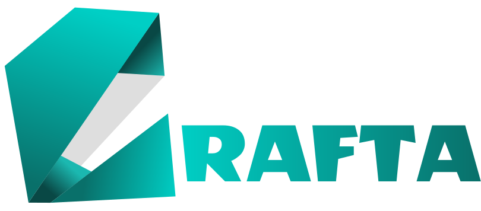

# ✨ Crafta - Craft what you imagine, instantly

<div align="center">
   <br/><br/>
  
  **An AI-powered website builder with instant design, full-stack generation, and lightning-fast Next.js performance, turning ideas into live, editable sites in seconds.**
  
  [](https://nextjs.org/)
  [](https://reactjs.org/)
  [](https://tailwindcss.com/)
  [](https://convex.dev/)
  [](https://ai.google.dev/)
  [](https://sandpack.codesandbox.io/)
  [](LICENSE)
</div>

---

## ✨ Key Features

- **🤖 AI-Powered Generation** - Google Gemini AI integration for intelligent website creation from natural language descriptions
- **⚡ Instant Website Building** - Generate complete, functional websites in seconds without writing a single line of code
- **🎨 Live Code Editor** - Sandpack-powered real-time code editing with instant preview and live reload
- **🔧 Full-Stack Generation** - Complete project structure with React, Vite, Tailwind CSS, and all necessary configurations
- **💬 Interactive Chat Interface** - AI-powered conversation system for iterative website development
- **🔐 User Authentication** - Google OAuth integration with secure user management
- **💳 Token-Based System** - Flexible pricing with token-based usage tracking
- **📁 Workspace Management** - Organized project workspaces with chat history and file management

## 🏗️ Architecture

```
crafta/
├── 📁 app/
│   ├── layout.js                    # 🏠 Root layout with providers
│   ├── page.js                      # 🎯 Main landing page with hero section
│   ├── ConvexClientProvider.jsx     # 🔄 Convex client provider wrapper
│   ├── provider.jsx                 # 🔄 Context providers wrapper
│   ├── globals.css                  # 🎨 Global styles and Tailwind
│   │
│   ├── 📁 (main)/                   # 📄 Main application routes
│   │   ├── pricing/                 # 💳 Pricing plans and token management
│   │   └── workspace/[id]/          # 🛠️ Dynamic workspace pages
│   │
│   └── 📁 api/                      # 🔌 API endpoints
│       ├── ai-chat/                 # 🤖 AI chat integration
│       └── gen-ai-code/             # 🎯 AI code generation
│
├── 📁 components/                   # 🎯 Reusable UI components
│   ├── 📁 custom/                   # 🧩 Custom application components
│   │   ├── ChatView.jsx             # 💬 AI chat interface
│   │   ├── CodeView.jsx             # 👨‍💻 Live code editor
│   │   ├── Header.jsx               # 📋 Navigation header
│   │   ├── Hero.jsx                 # 🎯 Landing page hero section
│   │   ├── HoverSidebar.jsx         # 📱 Hover navigation sidebar
│   │   ├── WorkspaceHeader.jsx      # 🛠️ Workspace navigation
│   │   └── WorkspaceSkeleton.jsx    # ⚡ Loading skeleton
│   │
│   └── 📁 ui/                       # 🎨 Base UI components (Radix)
│       ├── button.jsx               # 🔘 Button components
│       ├── dialog.jsx               # 💬 Dialog/modal components
│       ├── input.jsx                # 📝 Input components
│       └── background-beams.jsx     # ✨ Animated backgrounds
│
├── 📁 context/                      # 🔄 React context providers
│   ├── MessagesContext.jsx          # 💬 Chat messages state
│   ├── SandpackContext.jsx          # 🏗️ Code editor context
│   ├── UserDetailContext.jsx        # 👤 User authentication state
│   └── WorkspaceFilesContext.jsx    # 📁 File management context
│
├── 📁 convex/                       # 🗄️ Backend database and functions
│   ├── schema.js                    # 📊 Database schema definition
│   ├── users.js                     # 👤 User management functions
│   └── workspace.js                 # 🛠️ Workspace operations
│
├── 📁 data/                         # 📚 Static data and configurations
│   ├── Lookup.jsx                   # 🔍 Application text and templates
│   └── Prompt.jsx                   # 🤖 AI prompt templates
│
├── 📁 hooks/                        # 🪝 Custom React hooks
│   └── use-mobile.js                # 📱 Mobile detection hook
│
└── 📁 public/                       # 📂 Static assets
    ├── logo.svg                     # 🎨 Application logo
    └── title.svg                    # 🏷️ Application title
```

## 🚀 Quick Start

### Prerequisites

- **Node.js** 18+
- **npm/yarn/pnpm**
- **Google AI API Key** (Gemini 1.5)
- **Convex Account** (for backend)

### 1. Clone & Setup

```bash
# Clone the repository
git clone https://github.com/mohitooo28/Crafta
cd Crafta

# Install dependencies
npm install
```

### 2. Environment Configuration

Copy the example environment file and configure with your API keys:

```bash
# Copy the example environment file
cp .env.local.example .env.local

# Edit the .env.local file with your actual API keys
```

### 3. Convex Setup

1. **Install Convex CLI**:

   ```bash
   npm install -g convex
   ```

2. **Login to Convex**:

   ```bash
   npx convex dev --configure
   ```

3. **Start Convex Development Server**:
   ```bash
   npx convex dev
   ```

### 4. Start Development Server

```bash
# Start the Next.js development server
npm run dev
```

### 5. Access the Application

- **Frontend**: [http://localhost:3000](http://localhost:3000)
- **Convex Dashboard**: Check your Convex dashboard for backend monitoring

## 📖 How to Use

### 🎯 Website Generation

1. **Open Crafta** and use the main hero interface
2. **Describe Your Idea** - Type what you want to build (e.g., "Build a To-Do App")
3. **AI Processing** - The system generates your complete website
4. **Live Preview** - See your website running in real-time
5. **Edit & Customize** - Use the live code editor to make changes

### 💬 Interactive Development

1. **Chat with AI** - Ask questions about your code or request changes
2. **Iterative Refinement** - Get suggestions and improvements from AI
3. **Real-time Updates** - See changes instantly in the preview

### 🛠️ Workspace Management

1. **Access Your Workspaces** - View all your generated projects
2. **Continue Development** - Pick up where you left off
3. **Export & Deploy** - Download your project files for deployment

## 🛠️ Tech Stack

- **🚀 Next.js 15** - Full-stack React framework with App Router
- **⚛️ React 18** - UI framework with hooks and context
- **🎨 Tailwind CSS 4** - Utility-first CSS framework
- **🗄️ Convex** - Real-time backend database and functions
- **🤖 Google Gemini AI** - Advanced language model for code generation
- **🏗️ Sandpack** - Live code editing and preview
- **🔐 Google OAuth** - Secure user authentication
- **💳 PayPal** - Payment processing for token purchases

## 🔑 Required API Keys

### 1. 🧠 Google Gemini AI API Key

- Visit [Google AI Studio](https://makersuite.google.com/app/apikey)
- Create a new API key for Gemini 1.5 Flash model
- [Documentation](https://ai.google.dev/docs)

### 2. 🗄️ Convex Setup

- Create account at [Convex](https://convex.dev/)
- Create a new project
- Get your project URL
- [Documentation](https://docs.convex.dev/)

### 3. 🔐 Google OAuth

- Set up OAuth 2.0 credentials in [Google Cloud Console](https://console.cloud.google.com/)
- Configure authorized redirect URIs
- [Documentation](https://developers.google.com/identity/protocols/oauth2)

## 📄 License

This project is licensed under the MIT License - see the [LICENSE](LICENSE) file for details.

---

<div align="center">

**Built with ❤️ for instant website creation**

[🌟 Star this repo](../../stargazers) • [🐛 Report Bug](../../issues) • [💡 Request Feature](../../issues)

</div>
